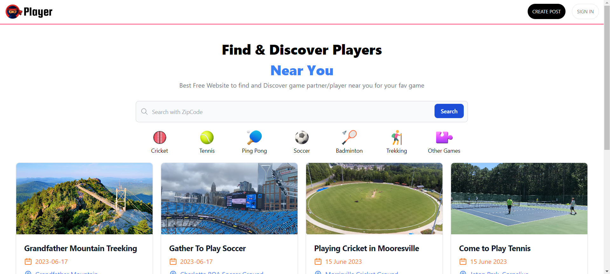

# Ninja Player

Ninja Player is a dynamic web application that helps users find and play with players nearby for various sports and activities. Built with Next.js, React, and styled using Tailwind CSS, the app integrates Firebase for authentication and database management, and secures user authentication with NextAuth.

## Features

- **Dynamic Next.js App**: Utilizes the powerful features of Next.js for server-side rendering and static site generation.
- **React**: Provides a seamless and responsive user experience.
- **Tailwind CSS**: Modern utility-first CSS framework for styling.
- **Firebase Integration**: Manages user authentication and stores data securely.
- **NextAuth**: Implements secure user authentication.

## Getting Started

### Prerequisites

- Node.js (v14 or later)
- npm or yarn
- Firebase Project Setup
- Environment variables for Firebase and NextAuth

### Installation

1. Clone the repository:

    ```bash
    git clone https://github.com/your-username/ninja-player.git
    cd ninja-player
    ```

2. Install the dependencies:

    ```bash
    npm install
    ```

    or

    ```bash
    yarn install
    ```

3. Create a `.env.local` file in the root directory and add your environment variables for Firebase and NextAuth:

    ```env
    NEXT_PUBLIC_FIREBASE_API_KEY=your_api_key
    NEXT_PUBLIC_FIREBASE_AUTH_DOMAIN=your_auth_domain
    NEXT_PUBLIC_FIREBASE_PROJECT_ID=your_project_id
    NEXT_PUBLIC_FIREBASE_STORAGE_BUCKET=your_storage_bucket
    NEXT_PUBLIC_FIREBASE_MESSAGING_SENDER_ID=your_messaging_sender_id
    NEXT_PUBLIC_FIREBASE_APP_ID=your_app_id
    NEXTAUTH_URL=http://localhost:3000
    NEXTAUTH_SECRET=your_nextauth_secret
    ```

4. Run the development server:

    ```bash
    npm run dev
    ```

    or

    ```bash
    yarn dev
    ```

5. Open [http://localhost:3000](http://localhost:3000) with your browser to see the app in action.

### Deployment

To deploy the application, you can use Vercel, which is the recommended platform for Next.js apps.

1. Commit your changes and push them to GitHub.
2. Go to [Vercel](https://vercel.com/) and log in.
3. Import your GitHub repository to Vercel.
4. Follow the deployment instructions provided by Vercel.

## Contributing

Contributions are welcome! Please fork the repository and use a feature branch. Pull requests are warmly welcome.

1. Fork the repository (`git clone https://github.com/your-username/ninja-player.git`)
2. Create your feature branch (`git checkout -b feature/fooBar`)
3. Commit your changes (`git commit -am 'Add some fooBar'`)
4. Push to the branch (`git push origin feature/fooBar`)
5. Create a new Pull Request

## License

This project is licensed under the MIT License. See the [LICENSE](LICENSE) file for details.

## Acknowledgements

- [Next.js](https://nextjs.org/)
- [React](https://reactjs.org/)
- [Tailwind CSS](https://tailwindcss.com/)
- [Firebase](https://firebase.google.com/)
- [NextAuth](https://next-auth.js.org/)

## Screenshot



